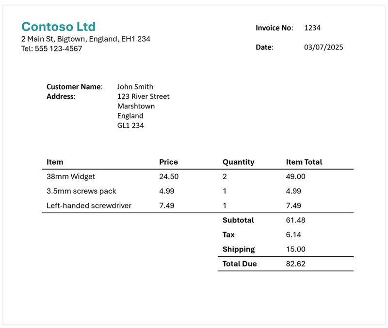

---
lab:
  title: マルチモーダル コンテンツから情報を抽出する
  description: Azure AI コンテンツ解釈を使用して、ドキュメント、画像、オーディオ記録、ビデオから分析情報を抽出します。
---

# マルチモーダル コンテンツから情報を抽出する

この演習では、Azure コンテンツ解釈を使用して、請求書、グラフを含むスライドの画像、音声メッセージのオーディオ記録、電話会議のビデオ記録など、さまざまなコンテンツ タイプから情報を抽出します。

この演習は約 **40** 分かかります。

## Azure AI Foundry ハブとプロジェクトを作成する

この演習で使用する Azure AI Foundry の機能には、Azure AI Foundry *ハブ* リソースに基づくプロジェクトが必要です。

1. Web ブラウザーで [Azure AI Foundry ポータル](https://ai.azure.com) (`https://ai.azure.com`) を開き、Azure 資格情報を使用してサインインします。 初めてサインインするときに開いたヒントまたはクイック スタート ウィンドウを閉じます。また、必要に応じて左上にある **Azure AI Foundry** ロゴを使用してホーム ページに移動します。それは次の画像のようになります (**[ヘルプ]** ウィンドウが開いている場合は閉じます)。

    

1. ブラウザーで `https://ai.azure.com/managementCenter/allResources` に移動し、**[新規作成]** を選択します。 次に、新しい **AI ハブ リソース**を作成するオプションを選択します。
1. **[プロジェクトの作成]** ウィザードで、プロジェクトの有効な名前を入力し、新しいハブを作成するオプションを選択します。 次に、**[ハブ名の変更]** リンクを使用して新しいハブの有効な名前を指定し、**[詳細オプション]** を展開し、プロジェクトに次の設定を指定します。
    - **[サブスクリプション]**:"*ご自身の Azure サブスクリプション*"
    - **リソース グループ**: *リソース グループを作成または選択します*
    - **[リージョン]**:  次のいずれかの場所を選択します (執筆時点では、Azure AI コンテンツ解釈はこれらのリージョンでのみ使用できます)。**
        - オーストラリア東部
        - スウェーデン中部
        - 米国西部

    > **メモ**: ポリシーを使用して使用可能なリソース名を制限する Azure サブスクリプションで作業している場合は、**[新しいプロジェクトの作成]** ダイアログ ボックスの下部にあるリンクを使用して、Azure portal を使用してハブを作成する必要があります。

    > **ヒント**: **[作成]** ボタンが無効な場合は、ハブの名前を一意の英数字にしてください。

1. プロジェクトが作成されるまで待ちます。

##  コンテンツのダウンロード

分析対象のコンテンツは .zip アーカイブ形式で格納されています。 ダウンロードしてローカル フォルダーに展開します。

1. 新しいブラウザー タブで、`https://github.com/microsoftlearning/mslearn-ai-information-extraction/raw/main/Labfiles/content/content.zip` から [content.zip](https://github.com/microsoftlearning/mslearn-ai-information-extraction/raw/main/Labfiles/content/content.zip) をダウンロードし、ローカル フォルダーに保存します。
1. ダウンロードした *content.zip* ファイルを展開し、含まれるファイルを表示します。 この演習では、これらのファイルを使用してさまざまなコンテンツ解釈アナライザーを構築します。

> **注**:特定のモダリティ (ドキュメント、画像、ビデオ、またはオーディオ) の分析のみについて関心がある場合は、以下の関連タスクに進んでください。 最適なエクスペリエンスを得るには、各タスクを実行して、さまざまなコンテンツから情報を抽出する方法を学習します。

## 請求書ドキュメントから情報を抽出する

請求書から情報を抽出できる Azure AI コンテンツ解釈アナライザーを構築します。 まず、サンプル請求書に基づいてスキーマを定義します。

### 請求書分析のスキーマを定義する

1. Azure AI Foundry プロジェクトのホーム ページが表示されているブラウザー タブの左側のナビゲーション ウィンドウで、**[コンテンツ解釈]** を選択します。
1. **[コンテンツ解釈]** ページで上部の **[カスタム タスク]** タブを選択します。
1. コンテンツ解釈のカスタム タスク ページで **[+ 作成]** を選択し、次の設定でタスクを作成します。
    - **タスク名**: `Invoice analysis`
    - **説明**: `Extract data from an invoice`
    - **単一ファイルのコンテンツ分析**:*選択*
    - **[詳細設定]**:
        - **Azure AI サービス接続**:Azure AI Foundry ハブの Azure AI サービス リソース**
        - **Azure Blob Storage アカウント**: *お使いの Azure AI Foundry ハブの既定のストレージ アカウント*
1. タスクが作成されるまで待ちます。

    > **ヒント**: ストレージへのアクセスでエラーが発生した場合は、少し待ってから、もう一度お試しください。 新しいハブのアクセス許可が反映されるまでに数分かかる場合があります。

1. **[スキーマの定義]** ページで、コンテンツ ファイルを抽出したフォルダーから **invoice-1234.pdf** ファイルをアップロードします。 このファイルには次の請求書が含まれています。

    

1. **[スキーマの定義]** ページで請求書ファイルをアップロードした後、"**請求書データの抽出**" テンプレートを選択し、**[作成]** を選択します。

    "請求書の分析" テンプレートには、請求書によく見られる共通フィールドが含まれています。** スキーマ エディターを使用すると、不要な推奨フィールドを削除したり、必要なカスタム フィールドを追加したりできます。

1. 推奨フィールドの一覧で、**BillingAddress** を選びます。 このフィールドはアップロードした請求書形式には必要ないので、選択したフィールド行に表示される **[フィールドの削除]** (**&#128465;**) アイコンを使用して削除します。
1. 次に、提案されたフィールドのうち、請求書スキーマには不要なものを削除します。
    - BillingAddressRecipient
    - CustomerAddressRecipient
    - CustomerId
    - CustomerTaxId
    - DueDate
    - InvoiceTotal
    - PaymentTerm
    - PreviousUnpaidBalance
    - PurchaseOrder
    - RemittanceAddress
    - RemittanceAddressRecipient
    - ServiceAddress
    - ServiceAddressRecipient
    - ShippingAddress
    - ShippingAddressRecipient
    - TotalDiscount
    - VendorAddressRecipient
    - VendorTaxId
    - TaxDetails
1. **[+ 新しいフィールドの追加]** ボタンを使用して次のフィールドを追加し、新しいフィールドごとに **[変更の保存]** (**&#10003;**) を選択します。

    | フィールド名 | フィールド説明 | 値の型 | メソッド |
    |--|--|--|--|
    | `VendorPhone` | `Vendor telephone number` | String | 抽出 |
    | `ShippingFee` | `Fee for shipping` | 番号 | 抽出 |

1. **Items** フィールドの行では、このフィールドが "テーブル" (請求書内の項目のコレクションを含む) であることに注意してください。** その **[編集]** (&#9638;) アイコンを選択すると、サブフィールドを含む新しいページが開きます。
1. **Items** テーブルから次のサブフィールドを削除します。
    - 日付
    - ProductCode
    - 出荷単位
    - TaxAmount
    - TaxRate
1. **[OK]** ボタンを使用して変更を確認し、請求書スキーマの最上位レベルに戻ります。

1. 完成したスキーマが次のようになっていることを確認し、**[保存]** を選択します。

    

1. **[アナライザーのテスト]** ページで、分析が自動的に開始されない場合は、**[分析の実行]** を選択します。 その後、分析が完了するまで待ちます。

1. 分析結果を確認します。これは次のようになっているはずです。

    

1. **[フィールド]** ペインで特定されたフィールドの詳細を表示します。

### 請求書用アナライザーの構築とテスト

これで、請求書からフィールドを抽出するモデルのトレーニングが完了したので、同様のドキュメントで使用するアナライザーを構築できます。

1. **[アナライザー一覧]** ページを選択し、**[+ アナライザーの作成]** を選択して、次のプロパティ (次に示すとおりに正確に入力) を使用して新しいアナライザーを構築します。
    - **名前**: `invoice-analyzer`
    - **説明**: `Invoice analyzer`
1. 新しいアナライザーの準備が整うのを待ちます (**[最新の情報に更新]** ボタンで確認できます)。
1. アナライザーが構築されたら、**invoice-analyzer** リンクを選択します。 アナライザーのスキーマで定義されているフィールドが表示されます。
1. **invoice-analyzer** ページの **[テスト]** タブを選択します。
1. **[+ テスト ファイルのアップロード]** ボタンを使用して、コンテンツ ファイルを抽出したフォルダーから **invoice-1235.pdf** をアップロードし、**[分析の実行]** をクリックして請求書からフィールド データを抽出します。

    分析対象の請求書は次のようになります。

    

1. **[フィールド]** ペインを確認し、アナライザーがテスト請求書から正しいフィールドを抽出したことを確認します。
1. **[結果]** ペインを確認して、アナライザーからクライアント アプリケーションに返された JSON 応答を確認します。
1. **[コード例]** タブでサンプル コードを確認します。これを使用して、コンテンツ解釈 REST インターフェイスを使用してアナライザーを呼び出すクライアント アプリケーションを開発できます。
1. **invoice-analyzer** ページを閉じます。

## スライド画像から情報を抽出する

グラフを含むスライドから情報を抽出できる Azure AI コンテンツ解釈アナライザーを構築します。

### 画像分析用スキーマを定義する

1. Azure AI Foundry プロジェクトのホーム ページが表示されているブラウザー タブの左側のナビゲーション ウィンドウで、**[コンテンツ解釈]** を選択します。
1. **[コンテンツ解釈]** ページで上部の **[カスタム タスク]** タブを選択します。
1. コンテンツ解釈のカスタム タスク ページで **[+ 作成]** を選択し、次の設定でタスクを作成します。
    - **タスク名**: `Slide analysis`
    - **説明**: `Extract data from an image of a slide`
    - **単一ファイルのコンテンツ分析**:*選択*
    - **[詳細設定]**:
        - **Azure AI サービス接続**:Azure AI Foundry ハブの Azure AI サービス リソース**
        - **Azure Blob Storage アカウント**: *お使いの Azure AI Foundry ハブの既定のストレージ アカウント*
1. タスクが作成されるまで待ちます。

    > **ヒント**: ストレージへのアクセスでエラーが発生した場合は、少し待ってから、もう一度お試しください。 新しいハブのアクセス許可が反映されるまでに数分かかる場合があります。

1. **[スキーマの定義]** ページで、コンテンツ ファイルを抽出したフォルダーから **slide-1.jpg** ファイルをアップロードします。 次に、"**画像分析**" テンプレートを選択し、**[作成]** を選択します。

    "画像分析" テンプレートには、定義済みフィールドは含まれていません。** 抽出する情報について説明するフィールドを定義する必要があります。

1. **[+ 新しいフィールドの追加]** ボタンを使用して次のフィールドを追加し、新しいフィールドごとに **[変更の保存]** (**&#10003;**) を選択します。

    | フィールド名 | フィールド説明 | 値の型 | メソッド |
    |--|--|--|--|
    | `Title` | `Slide title` | String | 作成 |
    | `Summary` | `Summary of the slide` | String | 作成 |
    | `Charts` | `Number of charts on the slide` | Integer | 作成 |

1. **[+ 新しいフィールドの追加]** ボタンを使用して、名前が `QuarterlyRevenue`、説明が `Revenue per quarter`、値の型が **Table** である新しいフィールドを追加し、新しいフィールドを保存します (**&#10003;**)。 次に、開いたテーブル サブフィールドの新しいページに次のサブフィールドを追加します。

    | フィールド名 | フィールド説明 | 値の型 | メソッド |
    |--|--|--|--|
    | `Quarter` | `Which quarter?` | String | 作成 |
    | `Revenue` | `Revenue for the quarter` | 番号 | 作成 |

1. **[戻る]** (**[新しいサブフィールドの追加]** ボタンの近くにある矢印アイコン) または **[&#10003; OK]** を選択してスキーマの最上位レベルに戻り、**[+ 新しいフィールドの追加]** ボタンを使用して、名前が `ProductCategories`、説明が `Product categories`、値の型が **Table** である新しいフィールドを追加し、新しいフィールドを保存します (**&#10003;**)。 次に、開いたテーブル サブフィールドの新しいページに次のサブフィールドを追加します。

    | フィールド名 | フィールド説明 | 値の型 | メソッド |
    |--|--|--|--|
    | `ProductCategory` | `Product category name` | String | 作成 |
    | `RevenuePercentage` | `Percentage of revenue` | 番号 | 作成 |

1. **[戻る]** (**[新しいサブフィールドの追加]** ボタンの近くにある矢印アイコン) または **[&#10003;OK]** を選択してスキーマの最上位レベルに戻り、次のようになっていることを確認します。 その後、 **[保存]** を選びます。

    

1. **[アナライザーのテスト]** ページで、分析が自動的に開始されない場合は、**[分析の実行]** を選択します。 その後、分析が完了するまで待ちます。

    分析対象のスライドは次のようになります。

    

1. 分析結果を確認します。これは次のようになっているはずです。

    

1. **[フィールド]** ペインで特定されたフィールドの詳細を表示し、**QuarterlyRevenue** フィールドと **ProductCategories** フィールドを展開してサブフィールドの値を確認します。

### アナライザーをビルドしてテストする

これで、スライドからフィールドを抽出するモデルのトレーニングが完了したので、同様のスライド画像で使用するアナライザーを構築できます。

1. **[アナライザー一覧]** ページを選択し、**[+ アナライザーの作成]** を選択して、次のプロパティ (次に示すとおりに正確に入力) を使用して新しいアナライザーを構築します。
    - **名前**: `slide-analyzer`
    - **説明**: `Slide image analyzer`
1. 新しいアナライザーの準備が整うのを待ちます (**[最新の情報に更新]** ボタンで確認できます)。
1. アナライザーが構築されたら、**slide-analyzer** リンクを選択します。 アナライザーのスキーマで定義されているフィールドが表示されます。
1. **slide-analyzer** ページの **[テスト]** タブを選択します。
1. **[+ テスト ファイルのアップロード]** ボタンを使用して、コンテンツ ファイルを抽出したフォルダーから **slide-2.jpg** をアップロードし、**[分析の実行]** をクリックして画像からフィールド データを抽出します。

    分析対象のスライドは次のようになります。

    

1. **[フィールド]** ペインを確認し、アナライザーがスライド画像から正しいフィールドを抽出したことを確認します。

    > **注**:スライド 2 には製品カテゴリ別の内訳が含まれていないため、製品カテゴリの収益データは見つかりません。

1. **[結果]** ペインを確認して、アナライザーからクライアント アプリケーションに返された JSON 応答を確認します。
1. **[コード例]** タブでサンプル コードを確認します。これを使用して、コンテンツ解釈 REST インターフェイスを使用してアナライザーを呼び出すクライアント アプリケーションを開発できます。
1. **slide-analyzer** ページを閉じます。

## ボイスメールのオーディオ記録から情報を抽出する

ボイスメール メッセージのオーディオ記録から情報を抽出できる Azure AI コンテンツ解釈アナライザーを構築します。

### オーディオ分析用スキーマを定義する

1. Azure AI Foundry プロジェクトのホーム ページが表示されているブラウザー タブの左側のナビゲーション ウィンドウで、**[コンテンツ解釈]** を選択します。
1. **[コンテンツ解釈]** ページで上部の **[カスタム タスク]** タブを選択します。
1. コンテンツ解釈のカスタム タスク ページで **[+ 作成]** を選択し、次の設定でタスクを作成します。
    - **タスク名**: `Voicemail analysis`
    - **説明**: `Extract data from a voicemail recording`
    - **単一ファイルのコンテンツ分析**:*選択*
    - **[詳細設定]**:
        - **Azure AI サービス接続**:Azure AI Foundry ハブの Azure AI サービス リソース**
        - **Azure Blob Storage アカウント**: *お使いの Azure AI Foundry ハブの既定のストレージ アカウント*
1. タスクが作成されるまで待ちます。

    > **ヒント**: ストレージへのアクセスでエラーが発生した場合は、少し待ってから、もう一度お試しください。 新しいハブのアクセス許可が反映されるまでに数分かかる場合があります。

1. **[スキーマの定義]** ページで、コンテンツ ファイルを抽出したフォルダーから **call-1.mp3** ファイルをアップロードします。 次に、"**Speech トランスクリプト分析**" テンプレートを選択し、**[作成]** を選択します。
1. 右側の **[コンテンツ]** ペインで **[文字起こしプレビューの取得]** を選択して、記録されたメッセージの文字起こしを表示します。

    "Speech トランスクリプト分析" テンプレートには、定義済みフィールドが含まれていません。** 抽出する情報について説明するフィールドを定義する必要があります。

1. **[+ 新しいフィールドの追加]** ボタンを使用して次のフィールドを追加し、新しいフィールドごとに **[変更の保存]** (**&#10003;**) を選択します。

    | フィールド名 | フィールド説明 | 値の型 | メソッド |
    |--|--|--|--|
    | `Caller` | `Person who left the message` | String | 作成 |
    | `Summary` | `Summary of the message` | String | 作成 |
    | `Actions` | `Requested actions` | String | 作成 |
    | `CallbackNumber` | `Telephone number to return the call` | String | 作成 |
    | `AlternativeContacts` | `Alternative contact details` | 文字列の一覧 | 作成 |

1. スキーマが次のようになっていることを確認します。 その後、 **[保存]** を選びます。

    

1. **[アナライザーのテスト]** ページで、分析が自動的に開始されない場合は、**[分析の実行]** を選択します。 その後、分析が完了するまで待ちます。

    オーディオ分析には時間がかかる場合があります。 待っている間に、以下のオーディオ ファイルを再生してみてください。

    <video controls src="https://github.com/MicrosoftLearning/mslearn-ai-information-extraction/raw/refs/heads/main/Instructions/Labs/media/call-1.mp4" title="呼び出し 1" width="300">
        <track src="https://github.com/MicrosoftLearning/mslearn-ai-information-extraction/raw/refs/heads/main/Instructions/Labs/media/call-1.vtt" kind="captions" srclang="en" label="English">
    </video>

    **注**:このオーディオは AI を使用して生成されました。

1. 分析結果を確認します。これは次のようになっているはずです。

    

1. **[フィールド]** ペインで特定されたフィールドの詳細を表示し、**AlternativeContacts** フィールドを展開して一覧表示された値を確認します。

### アナライザーをビルドしてテストする

これで、音声メッセージからフィールドを抽出するモデルのトレーニングが完了したので、同様のオーディオ記録で使用するアナライザーを構築できます。

1. **[アナライザー一覧]** ページを選択し、**[+ アナライザーの作成]** を選択して、次のプロパティ (次に示すとおりに正確に入力) を使用して新しいアナライザーを構築します。
    - **名前**: `voicemail-analyzer`
    - **説明**: `Voicemail audio analyzer`
1. 新しいアナライザーの準備が整うのを待ちます (**[最新の情報に更新]** ボタンで確認できます)。
1. アナライザーが構築されたら、**voicemail-analyzer** リンクを選択します。 アナライザーのスキーマで定義されているフィールドが表示されます。
1. **voicemail-analyzer** ページの **[テスト]** タブを選択します。
1. **[+ テスト ファイルのアップロード]** ボタンを使用して、コンテンツ ファイルを抽出したフォルダーから **call-2.mp3** をアップロードし、**[分析の実行]** をクリックしてオーディオ ファイルからフィールド データを抽出します。

    オーディオ分析には時間がかかる場合があります。 待っている間に、以下のオーディオ ファイルを再生してみてください。

    <video controls src="https://github.com/MicrosoftLearning/mslearn-ai-information-extraction/raw/refs/heads/main/Instructions/Labs/media/call-2.mp4" title="呼び出し 2" width="300">
        <track src="https://github.com/MicrosoftLearning/mslearn-ai-information-extraction/raw/refs/heads/main/Instructions/Labs/media/call-2.vtt" kind="captions" srclang="en" label="English">
    </video>

    **注**:このオーディオは AI を使用して生成されました。

1. **[フィールド]** ペインを確認し、アナライザーが音声メッセージから正しいフィールドを抽出したことを確認します。
1. **[結果]** ペインを確認して、アナライザーからクライアント アプリケーションに返された JSON 応答を確認します。
1. **[コード例]** タブでサンプル コードを確認します。これを使用して、コンテンツ解釈 REST インターフェイスを使用してアナライザーを呼び出すクライアント アプリケーションを開発できます。
1. **voicemail-analyzer** ページを閉じます。

## ビデオ会議の記録から情報を抽出する

電話会議のビデオ記録から情報を抽出できる Azure AI コンテンツ解釈アナライザーを構築します。

### ビデオ分析用スキーマを定義する

1. Azure AI Foundry プロジェクトのホーム ページが表示されているブラウザー タブの左側のナビゲーション ウィンドウで、**[コンテンツ解釈]** を選択します。
1. **[コンテンツ解釈]** ページで上部の **[カスタム タスク]** タブを選択します。
1. コンテンツ解釈のカスタム タスク ページで **[+ 作成]** を選択し、次の設定でタスクを作成します。
    - **タスク名**: `Conference call video analysis`
    - **説明**: `Extract data from a video conference recording`
    - **単一ファイルのコンテンツ分析**:*選択*
    - **[詳細設定]**:
        - **Azure AI サービス接続**:Azure AI Foundry ハブの Azure AI サービス リソース**
        - **Azure Blob Storage アカウント**: *お使いの Azure AI Foundry ハブの既定のストレージ アカウント*
1. タスクが作成されるまで待ちます。

    > **ヒント**: ストレージへのアクセスでエラーが発生した場合は、少し待ってから、もう一度お試しください。 新しいハブのアクセス許可が反映されるまでに数分かかる場合があります。

1. **[スキーマの定義]** ページで、コンテンツ ファイルを抽出したフォルダーから **meeting-1.mp4** ファイルをアップロードします。 次に、"**ビデオ分析**" テンプレートを選択し、**[作成]** を選択します。
1. 右側の **[コンテンツ]** ペインで **[文字起こしプレビューの取得]** を選択して、記録されたメッセージの文字起こしを表示します。

    "ビデオ分析" テンプレートは、ビデオのデータを抽出します。** 定義済みフィールドは含まれていません。 抽出する情報について説明するフィールドを定義する必要があります。

1. **[+ 新しいフィールドの追加]** ボタンを使用して次のフィールドを追加し、新しいフィールドごとに **[変更の保存]** (**&#10003;**) を選択します。

    | フィールド名 | フィールド説明 | 値の型 | メソッド |
    |--|--|--|--|
    | `Summary` | `Summary of the discussion` | String | 作成 |
    | `Participants` | `Count of meeting participants` | Integer | 作成 |
    | `ParticipantNames` | `Names of meeting participants` | 文字列の一覧 | 作成 |
    | `SharedSlides` | `Descriptions of any PowerPoint slides presented` | 文字列の一覧 | 作成 |
    | `AssignedActions` | `Tasks assigned to participants` | テーブル |  |

1. **AssignedActions** フィールドに入力して表示されるサブフィールドのテーブルに、次のサブフィールドを作成します。

    | フィールド名 | フィールド説明 | 値の型 | メソッド |
    |--|--|--|--|
    | `Task` | `Description of the task` | String | 作成 |
    | `AssignedTo` | `Who the task is assigned to` | String | 作成 |

1. **[戻る]** (**[新しいサブフィールドの追加]** ボタンの近くにある矢印アイコン) または **[&#10003;OK]** を選択してスキーマの最上位レベルに戻り、次のようになっていることを確認します。 その後、 **[保存]** を選びます。

1. スキーマが次のようになっていることを確認します。 その後、 **[保存]** を選びます。

    

1. **[アナライザーのテスト]** ページで、分析が自動的に開始されない場合は、**[分析の実行]** を選択します。 その後、分析が完了するまで待ちます。

    ビデオ分析には時間がかかる場合があります。 待っている間に、以下のビデオをご覧ください。

    <video controls src="https://github.com/MicrosoftLearning/mslearn-ai-information-extraction/raw/refs/heads/main/Instructions/Labs/media/meeting-1.mp4" title="会議 1" width="480">
        <track src="https://github.com/MicrosoftLearning/mslearn-ai-information-extraction/raw/refs/heads/main/Instructions/Labs/media/meeting-1.vtt" kind="captions" srclang="en" label="English">
    </video>

    **注**:このビデオは AI を使用して生成されました。

1. 分析が完了したら、次のような結果を確認します。

    

1. **[フィールド]** ペインで、追加したフィールドを含む、ビデオから抽出されたデータを表示します。 生成されたフィールド値を表示し、必要に応じて一覧とテーブル フィールドを展開します。

### アナライザーをビルドしてテストする

電話会議の記録からフィールドを抽出するモデルのトレーニングが完了したので、同様のビデオで使用するアナライザーを構築できます。

1. **[アナライザー一覧]** ページを選択し、**[+ アナライザーの作成]** を選択して、次のプロパティ (次に示すとおりに正確に入力) を使用して新しいアナライザーを構築します。
    - **名前**: `conference-call-analyzer`
    - **説明**: `Conference call video analyzer`
1. 新しいアナライザーの準備が整うのを待ちます (**[最新の情報に更新]** ボタンで確認できます)。
1. アナライザーが構築されたら、**conference-call-analyzer** リンクを選択します。 アナライザーのスキーマで定義されているフィールドが表示されます。
1. **conference-call-analyzer** ページの **[テスト]** タブを選択します。
1. **[+ テスト ファイルのアップロード]** ボタンを使用して、コンテンツ ファイルを抽出したフォルダーから **meeting-2.mp4** をアップロードし、分析を実行してオーディオ ファイルからフィールド データを抽出します。

    ビデオ分析には時間がかかる場合があります。 待っている間に、以下のビデオをご覧ください。

    <video controls src="https://github.com/MicrosoftLearning/mslearn-ai-information-extraction/raw/refs/heads/main/Instructions/Labs/media/meeting-2.mp4" title="会議 2" width="480">
        <track src="https://github.com/MicrosoftLearning/mslearn-ai-information-extraction/raw/refs/heads/main/Instructions/Labs/media/meeting-2.vtt" kind="captions" srclang="en" label="English">
    </video>

    **注**:このビデオは AI を使用して生成されました。

1. **[フィールド]** ペインを確認し、アナライザーによって抽出された電話会議ビデオのフィールドを表示します。
1. **[結果]** ペインを確認して、アナライザーからクライアント アプリケーションに返された JSON 応答を確認します。
1. **conference-call-analyzer** ページを閉じます。

## クリーンアップ

コンテンツ解釈サービスの操作が終わったら、不要な Azure コストが発生しないように、この演習で作成したリソースを削除する必要があります。

1. Azure AI Foundry ポータルでハブに移動し、概要ページでプロジェクトを選択して削除します。
1. Azure portal において、この演習で作成したリソース グループを削除します。
