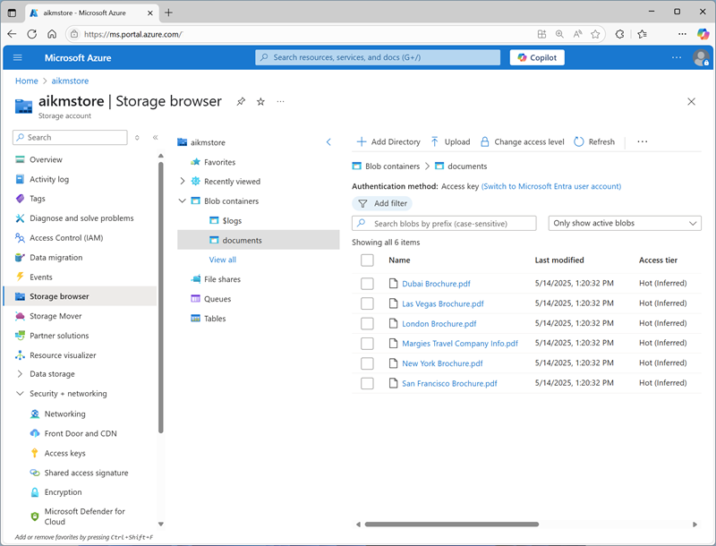

---
lab:
  title: ナレッジ マイニング ソリューションを作成する
  description: Azure AI 検索を使用すると、ドキュメントから重要な情報を抽出し、検索と分析を容易に行うことができます。
  duration: 40 minutes
  level: 400
  islab: true
  primarytopics:
    - Azure
---

# ナレッジ マイニング ソリューションを作成する

この演習では、AI 検索を使用して、架空の旅行代理店である Margie's Travel が管理するドキュメント セットのインデックスを作成します。 インデックス作成プロセスには、AI スキルを使ってキー情報を抽出して検索可能にすることが含まれます。

この演習は Python に基づいていますが、次のような複数の言語固有の SDK を使用して同様のアプリケーションを開発できます。

- [Python 用 Azure AI 検索クライアント ライブラリ](https://pypi.org/project/azure-search-documents/)
- [Microsoft .NET 用 Azure AI 検索クライアント ライブラリ](https://www.nuget.org/packages/Azure.Search.Documents)
- [JavaScript 用 Azure AI 検索クライアント ライブラリ](https://www.npmjs.com/package/@azure/search-documents)

この演習は約 **40** 分かかります。

## Azure リソースを作成する

Margie's Travel 用に作成するソリューションでは、お使いの Azure サブスクリプションに複数のリソースが必要です。 この演習では、Azure portal で直接作成します。 スクリプト、ARM、BICEP テンプレートを使用して作成することもできます。また、Azure AI 検索リソースを含む Azure AI Foundry プロジェクトを作成することもできます。

> **重要**: Azure リソースは同じ場所に作成する必要があります。

### "Azure AI 検索" リソースを作成する

1. Web ブラウザーで、[Azure portal](https://portal.azure.com) (`https://portal.azure.com`) を開き、Azure 資格情報を使用してサインインします。
1. **[&#65291; リソースの作成]** ボタンを選択し、`Azure AI 検索` を検索して、次の設定で **Azure AI 検索**リソースを作成します。
    - **[サブスクリプション]**:"*ご自身の Azure サブスクリプション*"
    - **リソース グループ**: *リソース グループを作成または選択します*
    - **サービス名**:検索リソースの有効な名前**
    - **[場所]**: *利用可能な任意の場所*
    - **価格レベル**: Free

1. デプロイが完了するまで待ち、デプロイされたリソースに移動します。
1. Azure portal の Azure AI 検索リソースのブレードにある **[概要]** ページを確認します。 ここでは、ビジュアル インターフェイスを使用して、検索ソリューションのさまざまなコンポーネントを作成、テスト、管理、および監視できます。データソース、インデックス、インデクサー、スキルセットを含みます。

### ストレージ アカウントの作成

1. ホーム ページに戻り、次の設定で**ストレージ アカウント** リソースを作成します。
    - **[サブスクリプション]**: *ご自身の Azure サブスクリプション*
    - **リソース グループ**: *Azure AI 検索リソースと同じリソース グループ*
    - **ストレージ アカウント名**:ストレージ リソースの有効な名前**
    - **リージョン**: *Azure AI 検索リソースと同じリージョン*
    - **プライマリ サービス**: Azure Blob Storage または Azure Data Lake Storage Gen 2
    - **パフォーマンス**: 標準
    - **冗長**: ローカル冗長ストレージ (LRS)

1. デプロイが完了するまで待ち、デプロイされたリソースに移動します。

    > **ヒント**: ストレージ アカウント ポータル ページを開いたままにしておきます。次の手順で使用します。

## Azure Storage にドキュメントをアップロードする

ナレッジ マイニング ソリューションでは、Azure Storage Blob コンテナー内の旅行パンフレットのドキュメントから情報を抽出します。

1. 新しいブラウザー タブで、`https://github.com/microsoftlearning/mslearn-ai-information-extraction/raw/main/Labfiles/knowledge/documents.zip` から [documents.zip](https://github.com/microsoftlearning/mslearn-ai-information-extraction/raw/main/Labfiles/knowledge/documents.zip) をダウンロードし、ローカル フォルダーに保存します。
1. ダウンロードした *documents.zip* ファイルを展開し、そこに含まれる旅行パンフレットのファイルを表示します。 これらのファイルから情報を抽出し、インデックスを作成します。
1. ストレージ アカウントの Azure portal ページが表示されているブラウザー タブで、左側のナビゲーション ウィンドウにある **[ストレージ ブラウザー]** を選択します。
1. ストレージ ブラウザーで **[BLOB コンテナー]** を選択します。

    この時点で、ストレージ アカウントには既定の **$logs** コンテナーのみが含まれているはずです。

1. ツール バーの **[+ コンテナー]** を選択し、次の設定で新しいコンテナーを作成します。
    - **名前**: `documents`
    - **匿名アクセス レベル**:非公開 (匿名アクセスなし)\*

    > **注**:\*ストレージ アカウントの作成時に匿名コンテナー アクセスを許可するオプションを有効にしていない場合、他の設定は選択できません。

1. **documents** コンテナーを選択して開き、**[アップロード]** ツール バーのボタンを使用して、次のように、先ほど **documents.zip** から抽出した .pdf ファイルをコンテナーのルートにアップロードします。

    

## インデクサーの作成と実行

ドキュメントを配置したので、そこから情報を抽出するインデクサーを作成できます。

1. Azure portal で、Azure AI 検索リソースを参照します。 その後、その **[概要]** ページで、**[データのインポート]** を選択します。
1. **[データへの接続]** ページの **[データ ソース]** リストで、**[Azure Blob Storage]** を選択します。
1. **[キーワード検索]** を選びます。 その後、次の値でデータ ストアの詳細を入力します。

1. **[データへの接続]** フォームで次のように設定します。
    - **ストレージ アカウント**: 最近作成したストレージ アカウント**
    - **BLOB コンテナー**: **documents** コンテナーを選びます。
    - 他のオプションは既定値のままにして、**[OK]** を選びます。

1. **[AI エンリッチメントの適用]** で次のように設定します。
    - **[フレーズを抽出]** を選びます。
    - **[エンティティを抽出]** を選び、設定アイコンを選んで、**[人]** と **[場所]** のみが選ばれていることを確認した後、**[保存]** を選びます。
    - **[画像からテキストを抽出]** を選び、設定アイコンを選んで、**[タグを生成する]** と **[コンテンツを分類する]** が選ばれていることを確認した後、**[保存]** を選びます。
    - まだ選ばれていない場合は、無料の Foundry Tools リソース オプションを選んだ後、**[次へ]** を選びます。

    > **注意**: Azure AI 検索 の無料の Azure AI サービス エンリッチメントを使うと、最大 20 個のドキュメントのインデックスを作成できます。 運用ソリューションでは、Azure AI サービス リソースを作成してアタッチする必要があります。

1. **[マッピングのプレビュー]** で次の構成を設定します。
    - フィールドは、前のステップで選んだオプションに基づいて既にマップされています。
    - 次のフィールドを確認し、それらが次の表で示すように構成されていることを確認します。 フィールドを更新するには、それを選んでから **[フィールドの構成]** を選びます。 他のすべてのフィールドは、既定の設定をそのまま使います。

    | ターゲット インデックス フィールド名 | [取得可能] | フィルター可能 | ソート可能 | ファセット可能 | 検索可能 |
    | ---------- | ----------- | ---------- | -------- | --------- | ---------- |
    | metadata_storage_size | &#10004; | &#10004; | &#10004; | | |
    | metadata_storage_last_modified | &#10004; | &#10004; | &#10004; | | |
    | タイトル | &#10004; | &#10004; | &#10004; | | &#10004; |
    | locations | &#10004; | &#10004; | | | &#10004; |
    | persons | &#10004; | &#10004; | | | &#10004; |
    | KeyPhrase | &#10004; | &#10004; | | | &#10004; |

    - 選択内容を注意深く再確認してください。
    - [**次へ**] を選択します。

1. **[詳細設定]** タブで次のように設定します。
    - **[セマンティック ランカーを有効にする]** がオンになっていることを確認します。
    - まだ選択されていない場合は、**[スケジュール]** を **[1 回]** に設定します。
    - [**次へ**] を選択します。

1. **[確認と作成]** で、**[オブジェクト名プレフィックス]** を「`margies-index`」に設定した後、**[作成]** を選びます。
1. 成功通知は閉じてかまいません。
1. 左側のナビゲーション ウィンドウの **[検索管理]** で、**[インデクサー]** ページを表示します。 **margies-index-indexer** が表示されます。 数分待ち、**[状態]** に "**成功**" と示されるまで **[&#8635; 最新の情報に更新]** をクリックします。

## インデックスを検索する

インデックスができたので、検索できます。

1. Azure AI 検索リソースの **[概要]** ページに戻り、ツール バーの **[Search エクスプローラー]** を選択します。
1. 検索エクスプローラーの **[クエリ文字列]** ボックスに、「`*`」(1 つのアスタリスク) を入力し、**[検索]** を選択します。

    このクエリは、インデックス内のすべてのドキュメントを JSON 形式で取得します。 結果を調べて、選択した認知スキルによって抽出されたドキュメント コンテンツ、メタデータ、および強化されたデータを含む各ドキュメントのフィールドをメモします。

1. **[表示]** メニューで **[JSON ビュー]** を選択し、検索の JSON 要求が次のように表示されることを確認します。

    ```json
    {
      "search": "*",
      "count": true
    }
    ```

1. 結果の上部には、検索によって返されたドキュメントの数を示す **@odata.count** フィールドが含まれています。

1. 次に示すように JSON 要求を変更して **select** パラメーターを含めます。

    ```json
    {
      "search": "*",
      "count": true,
      "select": "title,locations"
    }
    ```

        This time the results include only the file name and any locations mentioned in the document content. The file name is in the **title** field. The **locations** field was generated by an AI skill.

1. 次に、次のクエリ文字列を試してください。

    ```json
    {
      "search": "New York",
      "count": true,
      "select": "title,keyPhrases"
    }
    ```

    この検索では、検索可能なフィールドのいずれかで "ニューヨーク" に言及しているドキュメントが検索され、ドキュメント内のファイル名とキーフレーズが返されます。

1. もう 1 つのクエリも試してみましょう。

    ```json
    {
        "search": "New York",
        "count": true,
        "select": "title,keyPhrases",
        "filter": "metadata_storage_size lt 380000"
    }
    ```

    このクエリにより、サイズが 380,000 バイト未満で "New York" に言及しているすべてのドキュメントのファイル名とキー フレーズが返されます。

## 検索クライアント アプリケーションを作成する

有用なインデックスができたので、クライアント アプリケーションからそれを使用できます。 これを行うには、REST インターフェイスを使用し、要求を送信し、HTTP　を介して　JSO　N形式で応答を受信します。または、お好みのプログラミング言語用のソフトウェア開発キット (SDK) を使用することもできます。 この演習では、SDK を使用します。

> **注**: **C#** または **Python** 用の SDK のいずれかに使用することを選択できます。 以下の手順で、希望する言語に適したアクションを実行します。

### 検索リソースのエンドポイントとキーを取得する

1. Azure portal で、Search エクスプローラー ページを閉じて、Azure AI 検索リソースの **[概要]** ページに戻ります。

    **[URL]** の値をメモします。**https://*your_resource_name*.search.windows.net** のような値です。 これは、検索リソースのエンドポイントです。

1. 左側のナビゲーション ウィンドウで **[設定]** を展開し、**[キー]** ページを表示します。

    2 つの **admin** キーと 1 つの **query** キーがあることに注意してください。 *管理者*キーは、検索リソースを作成および管理するために使用されます。*クエリ* キーは、検索クエリを実行するだけでよいクライアント アプリケーションによって使用されます。

    クライアント アプリケーションのエンドポイントと**クエリ** キーが必要になります。**

    > **注意**: Azure AI 検索 では、サービス用に既定のクエリ キーが 1 つ作成されます。 Azure portal では、この既定のクエリ キーは名前が空白で表示される場合があります。 これは正しい動作です。

### Azure AI 検索 SDK を使用する準備をする

1. Azure portal で上部の検索バーの右側にある **[\>_]** ボタンを使用して、サブスクリプションにストレージがない ***PowerShell*** 環境を選択し、Azure portal で新しい Cloud Shell を作成します。

    Azure portal の下部にあるペインに Cloud Shell のコマンド ライン インターフェイスが表示されます。 作業しやすくするために、このウィンドウのサイズを変更したり最大化したりすることができます。 最初に、Cloud Shell と Azure portal の両方を確認する必要があります (必要なエンドポイントとキーを見つけてコピーできるようにするため)。

1. Cloud Shell ツール バーの **[設定]** メニューで、**[クラシック バージョンに移動]** を選択します (これはコード エディターを使用するのに必要です)。

    **<font color="red">続行する前に、クラシック バージョンの Cloud Shell に切り替えたことを確認します。</font>**

1. Cloud Shell 画面で、次のコマンドを入力して、この演習のコード ファイルを含む GitHub リポジトリを複製します (コマンドを入力するか、クリップボードにコピーしてから、コマンド ラインで右クリックし、プレーンテキストとして貼り付けます)。

    ```
   rm -r mslearn-ai-info -f
   git clone https://github.com/microsoftlearning/mslearn-ai-information-extraction mslearn-ai-info
    ```

    > **ヒント**: Cloudshell にコマンドを入力すると、出力が大量のスクリーン バッファーを占有する可能性があります。 `cls` コマンドを入力して、各タスクに集中しやすくすることで、スクリーンをクリアできます。

1. リポジトリが複製されたら、アプリケーション コード ファイルを含むフォルダーに移動します。

    ```
   cd mslearn-ai-info/Labfiles/knowledge/python
   ls -a -l
    ```

1. 次のコマンドを実行して、Azure AI 検索 SDK と Azure ID パッケージをインストールします。

    ```
   python -m venv labenv
   ./labenv/bin/Activate.ps1
   pip install -r requirements.txt azure-identity azure-search-documents==11.5.1
    ```

1. 次のコマンドを実行して、アプリの構成ファイルを編集します。

    ```
   code .env
    ```

    構成ファイルがコード エディターで開かれます。

1. 構成ファイルを編集して、次のプレースホルダー値を置き換えます。

    - **your_search_endpoint** (Azure AI 検索リソースのエンドポイントに置き換えます)**
    - **your_query_key** (Azure AI 検索リソースのクエリ キーに置き換えます)**
    - **your_index_name** (使用するインデックス名 (`margies-index`) に置き換えます)**

1. プレースホルダーを更新したら、**Ctrl + S** キー コマンドを使用してファイルを保存し、**Ctrl + Q** キー コマンドを使用してファイルを閉じます。

    > **ヒント**: Azure portal からエンドポイントとキーをコピーしたら、作業しやすいように Cloud Shell ペインを最大化することをお勧めします。

1. 次のコマンドを実行して、アプリのコード ファイルを開きます。

    ```
   code search-app.py
    ```

    コード ファイルがコード エディターで開かれます。

1. コードを見直し、次のアクションが実行されていることを確認します。

    - 編集した構成ファイルから、Azure AI 検索リソースとインデックスの構成設定を取得します。
    - エンドポイント、キー、インデックス名を使用して **SearchClient** を作成し、検索サービスに接続します。
    - ユーザーに (「quit」と入力するまで) 検索クエリを入力するように促します
    - クエリを使ってインデックスを検索すると、次のフィールドが返されます (タイトルの順)。
        - タイトル
        - 場所
        - persons
        - KeyPhrase
    - 返された検索結果を解析して、結果セット内の各ドキュメントに対して返されたフィールドを表示します。

1. コード エディターペインを閉じ (*Ctrl + Q* キー)、Cloud Shell コマンド ライン コンソール ペインは開いたままにします
1. 次のコマンドを入力してアプリを実行します。

    ```
   python search-app.py
    ```

1. プロンプトが表示されたら、「`London`」などのクエリを入力して結果を表示します。
1. 「`flights`」などの別のクエリを試してください。
1. アプリのテストが完了したら、「`quit`」と入力して閉じます。
1. Cloud Shell を閉じて、Azure portal に戻ります。

## ナレッジ ストアに関する注意

ナレッジ ストアの手順は、このバージョンの演習からは除外されています。

Azure portal での現在の**インポート データ** キーワード検索フローでは、このシナリオ用のナレッジ ストアは作成されず、この演習ではマルチモーダルの代替手段は採用されていません。

## クリーンアップ

これで演習が完了したので、不要になったすべてのリソースを削除します。 Azure リソースを削除します。

1. **Azure portal** で、[リソース グループ] を選択します。
1. 不要なリソース グループを選び、**[リソース グループの削除]** を選択します。

## 詳細

Azure AI 検索の詳細については、「[Azure AI 検索のドキュメント](https://docs.microsoft.com/azure/search/search-what-is-azure-search)」をご覧ください。
